---
# Preamble

## Author
author:
  name: Верниковская Екатерина Андреевна
  degrees: DSc
  email: 11322361366@pfur.ru
  affiliation:
    - name: Российский университет дружбы народов
      country: Российская Федерация
      postal-code: 117198
      city: Москва
      address: ул. Миклухо-Маклая, д. 6

## Title
title: Отчёт по лабораторной работе №1
subtitle: Компьютерный практикум по статистическому анализу данных
license: CC BY
date: 2026-09-09

## Generic options
lang: ru-RU
crossref:
  lof-title: Список иллюстраций
  lot-title: Список таблиц
  lol-title: Листинги

## Fonts 
mainfont: PT Serif 
romanfont: PT Serif 
sansfont: PT Sans 
monofont: PT Mono 
mainfontoptions: Ligatures=TeX 
romanfontoptions: Ligatures=TeX 
sansfontoptions: Ligatures=TeX,Scale=MatchLowercase 
monofontoptions: Scale=MatchLowercase,Scale=0.9

## Formats
format:
### Pdf output format
  beamer:
    toc: true
    toc-title: Содержание
    number-sections: true
    colorlinks: false
    toc-depth: 2
    slide_level: 2
    aspectratio: 169
    section-titles: true
    theme: metropolis
    themeoptions: progressbar=frametitle,sectionpage=progressbar,numbering=fraction
    pdf-engine: xelatex
    fontenc: T2A
#### Language
    babel-lang: russian
    babel-otherlangs: english

### Html output
  revealjs:
    transition: slide
    margin: 0.2
    smaller: false
    output-ext: html
    theme: beige
    logo: _resources/image/logo_rudn.png
---

# Вводная часть

## Цель работы

Целью данной работы является подготовка рабочего пространства и инструментария для работы с языком программирования Julia, знакомство на простейших примерах с основами синтаксиса Julia

## Задание

1. Установить под свою операционную систему Julia, Jupyter
2. Используя Jupyter Lab, повторить примеры приведённые в тексте лабораторной работы
3. Выполнить задания для самостоятельной работы

# Выполнение лабораторной работы

## Подготовка инструментария к работе

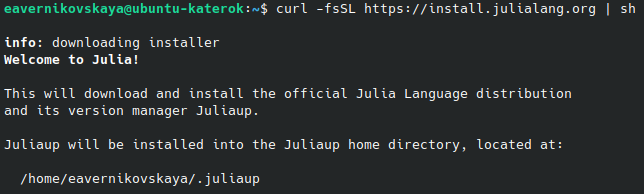{#fig-001 width=70%}

## Подготовка инструментария к работе

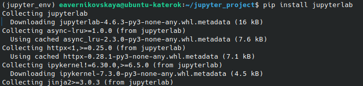{#fig-002 width=70%}

## Подготовка инструментария к работе

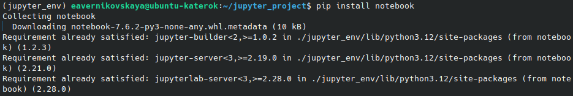{#fig-003 width=70%}

## Подготовка инструментария к работе

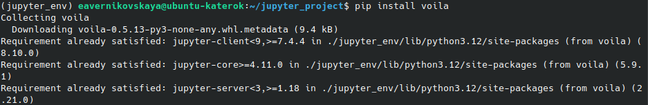{#fig-004 width=70%}

## Подготовка инструментария к работе

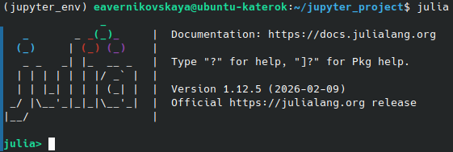{#fig-005 width=70%}

## Подготовка инструментария к работе

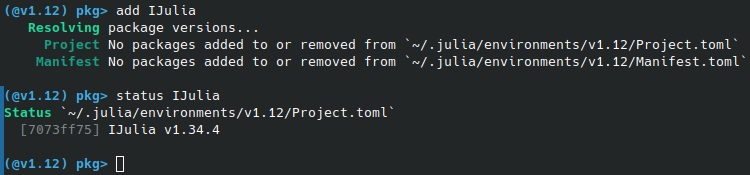{#fig-006 width=70%}

## Основы работы в блокноте Jupyter

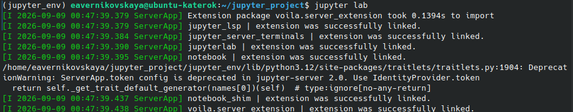{#fig-007 width=70%}

## Основы работы в блокноте Jupyter

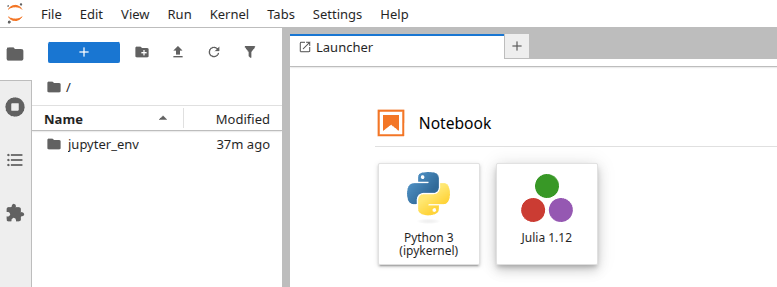{#fig-008 width=70%}

## Основы работы в блокноте Jupyter

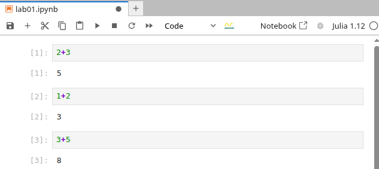{#fig-009 width=70%}

## Основы работы в блокноте Jupyter

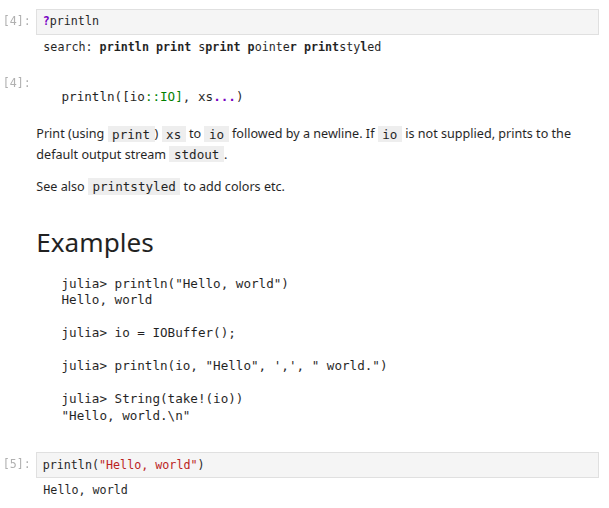{#fig-010 width=60%}

## Основы работы в блокноте Jupyter

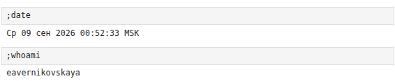{#fig-011 width=70%}

## Основы синтаксиса Julia на примерах

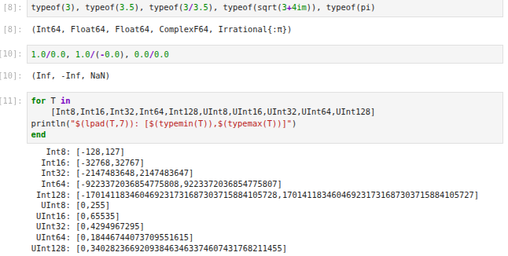{#fig-012 width=70%} 

## Основы синтаксиса Julia на примерах

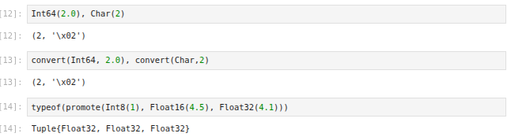{#fig-013 width=70%} 

## Основы синтаксиса Julia на примерах

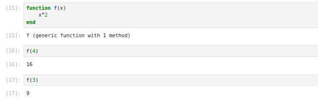{#fig-014 width=70%} 

## Основы синтаксиса Julia на примерах

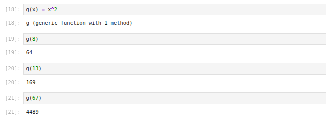{#fig-015 width=70%} 

## Основы синтаксиса Julia на примерах

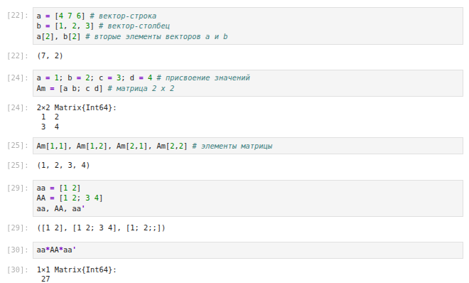{#fig-016 width=70%} 

## Задания для самостоятельной работы

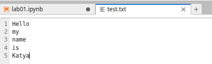{#fig-017 width=70%}  

## Задания для самостоятельной работы

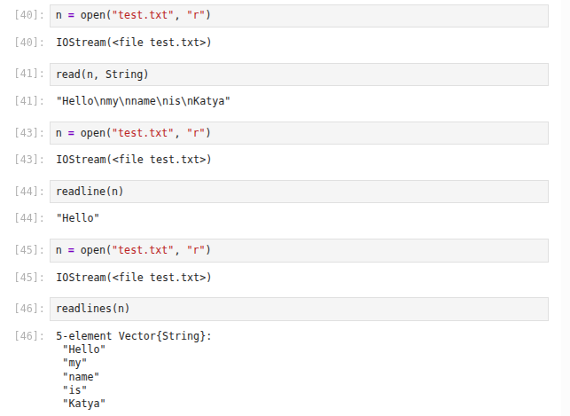{#fig-018 width=65%} 

## Задания для самостоятельной работы

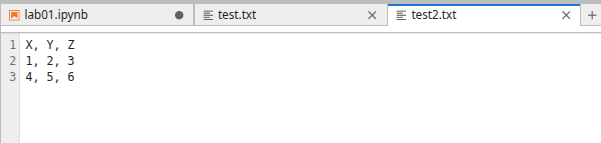{#fig-019 width=70%}  

## Задания для самостоятельной работы

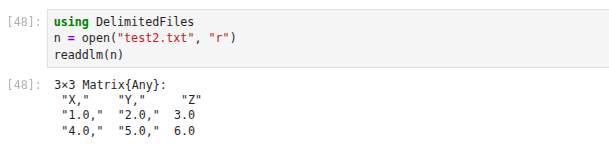{#fig-020 width=70%} 

## Задания для самостоятельной работы

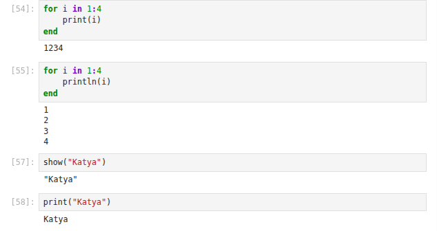{#fig-021 width=70%}  

## Задания для самостоятельной работы

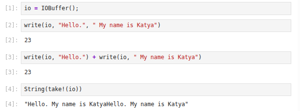{#fig-022 width=70%}  

## Задания для самостоятельной работы

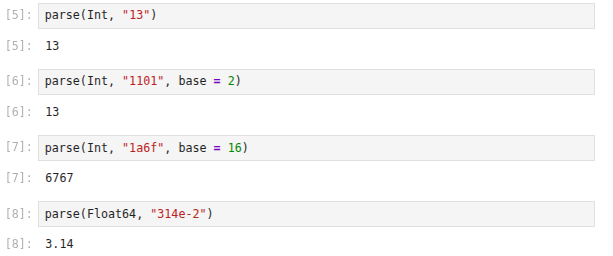{#fig-023 width=70%} 

## Задания для самостоятельной работы

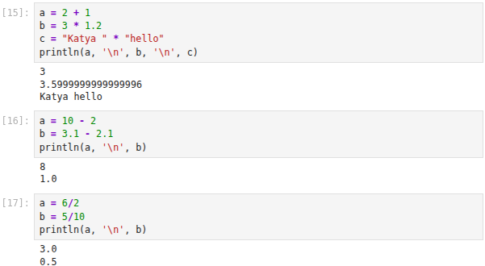{#fig-024 width=70%}

## Задания для самостоятельной работы

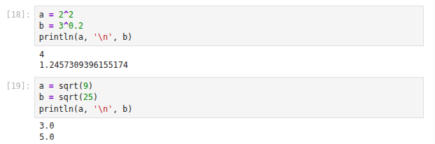{#fig-025 width=70%}

## Задания для самостоятельной работы

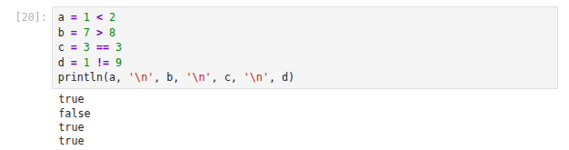{#fig-026 width=70%}

## Задания для самостоятельной работы

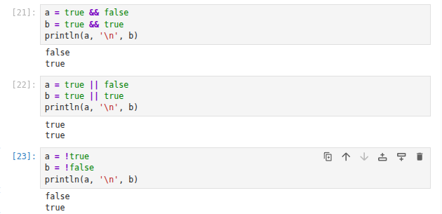{#fig-027 width=70%}

## Задания для самостоятельной работы

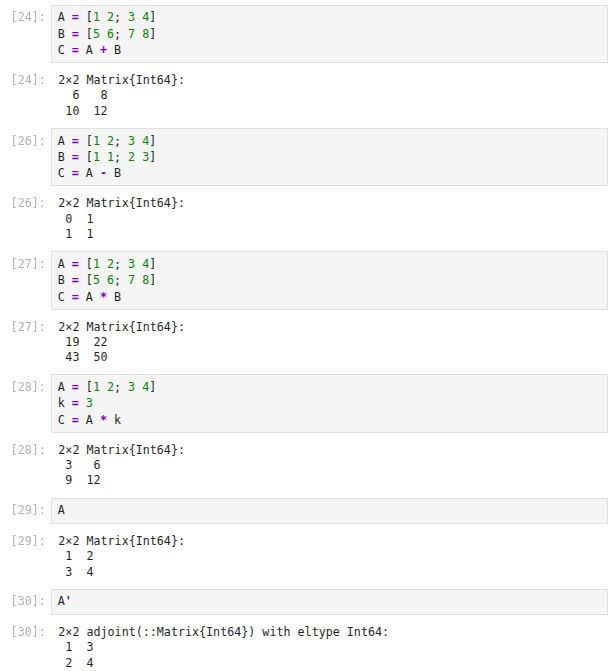{#fig-028 width=40%}

## Задания для самостоятельной работы

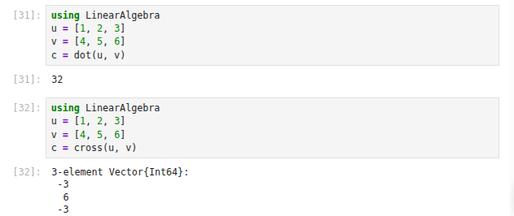{#fig-029 width=70%}

# Подведение итогов

## Выводы

В ходе выполнения лабораторной работы №1 мы подготовили рабочее пространство и инструментарий для
работы с языком программирования Julia, на простейших примерах познакомились с основами синтаксиса Julia

## Список литературы

1. [Лаборатораня работа №1](https://esystem.rudn.ru/pluginfile.php/3319644/mod_resource/content/2/001-lab_intro_julia.pdf)
2. [Julia](https://julialang.org/)
3. [Jupyter](https://jupyter.org/)
4. [Julia 1.12 Documentation](https://docs.julialang.org/en/v1/)
